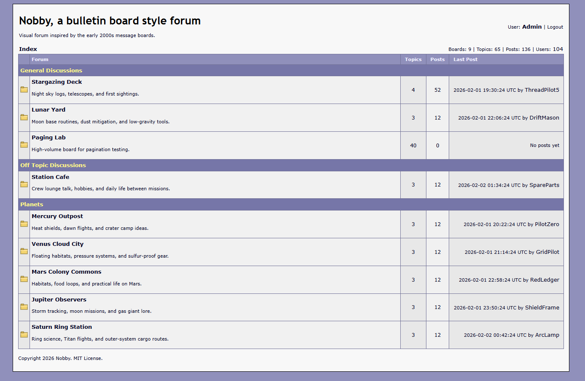

# Nobby - A Nostalgic Bulletin Board server for Nim.



I grew up on the early internet, when many communities had their own small forums.
There were boards for OS development, game development, flat assembler, panda3d, and almost every other topic.
Those spaces were simple, focused, and full of useful information.
Today most discussion is centralized on social media, but I wanted that old style back.

Nobby is my take on the classic phpBB era, built with modern Nim tools instead of old PHP stacks.
It is a simple bulletin board inspired by early-2000s web forums.

## Why Nobby

- Bring back small community-owned bulletin boards.
- Keep the stack simple and easy to understand.
- Prefer server-rendered HTML over client-side javascript.
- Build with Nim and libraries I made.
- Use this as a template for your own Nim server side website.

## Stack

- [mummy](https://github.com/guzba/mummy) for the HTTP server.
- [debby](https://github.com/treeform/debby) for data storage.
- [taggy](https://github.com/treeform/taggy) for server-side HTML generation.
- [webby](https://github.com/treeform/webby) for web utilities.
- [curly](https://github.com/guzba/curly) for HTTP client.
- [chrono](https://github.com/treeform/chrono) for time utilities.
- [crunchy](https://github.com/guzba/crunchy) for password hashing.
- [markdown](https://github.com/soasme/nim-markdown) for markdown rendering.

Nobby favors old-fashioned, server side rendered pages that are easy to inspect and reason about.
Simple HTML is still fast, reliable, and pleasant to work with.
The AI can use this codebase to build its own server side 2000 style websites.

## Install

```bash
nimby install nobby
```
